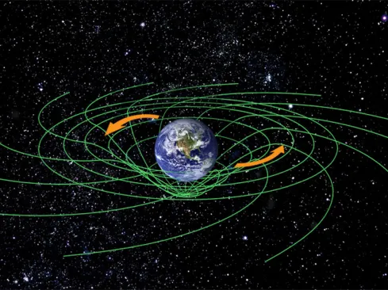
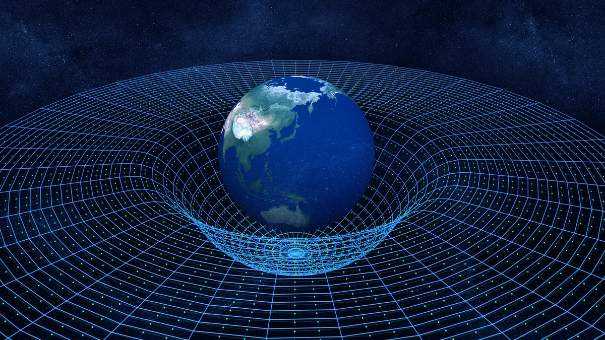
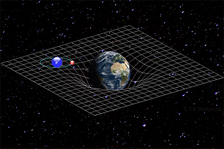

<div align="center">

# Gravitational Well 3D

**Multi-Body Spacetime Topology — an interactive 3D visualization of General Relativity**

</div>

---

## About this Project

I created this project because I wanted a new way to visualize how gravity really happens in a 3D world like ours.

Most educational materials and images found online represent spacetime as a **flat 2D surface** (often called the "rubber sheet" analogy). While useful for beginners, this representation is fundamentally incorrect.

In our universe, spacetime isn't a sheet; it's a volumetric fabric that exists in all directions. Gravity doesn't just pull "down" — it warps the very geometry of space around a mass from every possible angle.

### The "Flat" Misconception

<p align="center">
  
  
  
</p>
<p align="center">
  <sub><i>Common 2D representation&nbsp;&nbsp;·&nbsp;&nbsp;Planar orbit focus&nbsp;&nbsp;·&nbsp;&nbsp;The "downward" well trap</i></sub>
</p>

All three of these images share the same flaw: they collapse a three-dimensional phenomenon onto a single plane, biasing intuition toward thinking gravity "pulls down" into a hole.

### A 3D Approach

This simulation uses a **3D volumetric grid** to show how mass deforms space in three dimensions. By adjusting the **Divisions** and **Intensity**, you can see the topology change not just on a plane, but throughout the volume of the simulation.

This is a more faithful representation of General Relativity, where **matter tells space how to curve, and space tells matter how to move** — in all three spatial dimensions.

You can spawn multiple celestial bodies, change their mass and position, enable gravitational waves, and inject test particles to watch them follow geodesics through curved space.

## Features

- **3D volumetric grid** deformed in real time by a GLSL vertex shader
- **Up to 8 simultaneous masses**, each with its own position, radius and color
- **Gravitational intensity** control with presets ranging from the Moon (0.16 G) to a Neutron Star (extreme)
- **Gravitational waves** — animated ripples in the spacetime fabric à la Einstein 1916
- **Test particles** with motion trails that follow geodesics through curved space
- **Scenario presets**: Black Hole, Binary System, Triple System, Standard Well
- **Adjustable grid resolution** (up to 60³ divisions) and transparency
- **Starfield background** + orbit camera controls
- Frosted-glass control panel UI with inline tooltips

## Tech Stack

| Layer        | Technology |
| ------------ | ---------- |
| Rendering    | [Three.js](https://threejs.org/) (WebGL) + custom GLSL shaders |
| UI           | [React 19](https://react.dev/) + TypeScript |
| Styling      | [Tailwind CSS v4](https://tailwindcss.com/) |
| Build / Dev  | [Vite 6](https://vitejs.dev/) |
| Icons        | [lucide-react](https://lucide.dev/) |

## Project Structure

```
.
├── src/
│   ├── App.tsx          # Main React component, Three.js scene, shaders, UI
│   ├── main.tsx         # React entry point
│   ├── index.css        # Tailwind + custom scrollbar styles
│   └── vite-env.d.ts
├── index.html           # Vite entry HTML
├── vite.config.ts       # Vite + Tailwind + React plugins
├── tsconfig.json
├── package.json
├── .env.example         # Optional env vars (GEMINI_API_KEY, APP_URL)
├── gravity-picture.webp
├── gravitywell-1WEB.jpg
└── GettyImages-1046128816.webp
```

The entire simulation — React UI, Three.js scene setup, animation loop, and GLSL shaders — lives in a single self-contained `src/App.tsx` file.

## Getting Started

### Prerequisites

- [Node.js](https://nodejs.org/) 18+ (recommended 20+)
- A WebGL-capable browser (Chrome, Firefox, Safari, Edge)

### Install & run

```bash
# 1. Install dependencies
npm install

# 2. (Optional) Create a local env file if you plan to use Gemini integrations
cp .env.example .env.local
#   then edit .env.local and set GEMINI_API_KEY=...

# 3. Start the dev server
npm run dev
```

The app will be available at <http://localhost:3000>.

> **Note:** `GEMINI_API_KEY` is defined in `vite.config.ts` but the current simulation does not require it to run — leave it unset if you don't need it.

### Available scripts

| Script           | Description                                    |
| ---------------- | ---------------------------------------------- |
| `npm run dev`    | Start Vite dev server on port 3000             |
| `npm run build`  | Build production bundle into `dist/`           |
| `npm run preview`| Preview the production build locally           |
| `npm run lint`   | Type-check the project (`tsc --noEmit`)        |
| `npm run clean`  | Remove the `dist/` folder                      |

## Controls

All controls live in the floating **Control Panel** on the left side of the screen.

### Simulation
| Control       | Range   | What it does |
| ------------- | ------- | ------------ |
| Divisions     | 1–60    | Grid resolution. Higher = finer curvature, heavier on the GPU |
| Grid Alpha    | 0–1     | Transparency of the grid lines |
| Presets       | —       | Black Hole · Binary System · Triple System · Standard Well |

### Mass Management
- **+ Add Mass** — add a new body (up to 8)
- **Object selector** — pick which mass to edit
- **Radius** — physical size of the body (drives gravitational mass in the shader)
- **X / Y / Z Position** — coordinates inside the cube

### Physics & Waves
| Control       | Range    | What it does |
| ------------- | -------- | ------------ |
| Deform Space  | on/off   | Toggle GR curvature on the grid |
| Intensity (G) | 0.1–20   | Global gravitational multiplier |
| Gravity Presets | —      | Moon, Mars, Earth, Saturn, Neptune, Jupiter, Sun, White Dwarf, Neutron Star |
| Waves         | 0–5      | Amplitude of gravitational-wave ripples |

### Particles
- **Spawn** — emits 20 test particles with random velocities
- **Clear** — remove all particles
- **Simulate Orbit** — toggle particle physics on/off (visualizes geodesics)

### Camera

The scene uses [OrbitControls](https://threejs.org/docs/#examples/en/controls/OrbitControls):

- **Left-drag** — orbit
- **Right-drag** — pan
- **Scroll** — zoom

## How It Works

### The deformable cubic grid

`buildCubeGridGeometry(divs)` constructs a 3D wireframe cube made of line segments along the X, Y and Z axes, subdivided so each line has enough vertices to bend smoothly when warped by the shader.

### The vertex shader (`gridVertexShader`)

For each vertex of the grid, the shader computes the displacement caused by every active mass:

```
base    = (G · mass²) / max(r, minR)²   // inverse-square law
base    = base / (1 + base)             // saturation
falloff = 1 / (1 + 0.015·r)             // gentle distance falloff
wave    = sin(r·0.5 − t·5) · e^(−r·0.02) · waveAmp   // gravitational waves
```

Each vertex is then pulled radially toward the mass by an amount proportional to `base` (with a `wellMul` multiplier), clamped so it never enters the sphere's surface, and finally projected back inside the cube boundary so the wireframe never escapes its bounding box.

Up to `MAX_MASSES = 8` bodies are summed per vertex via uniform arrays.

### Particle physics

Particles run on the CPU in the animation loop. Each particle accumulates an acceleration from every mass:

```
a = (radius · 2 · wellMul · gravScale) / max(distSq, 10)
```

then integrates `velocity += a · dt` and `position += velocity`. Trails are stored as a 40-point rolling history per particle.

## Customization

A few constants near the top of `src/App.tsx` make it easy to tweak the feel:

```ts
const DEFAULT_DIVS = 20;     // initial grid resolution
const MAX_DIVS = 60;         // upper bound (perf-sensitive)
const CUBE_SIZE = 100;       // world-space cube edge
const INITIAL_RADIUS = 5;    // starting mass radius
const MAX_MASSES = 8;        // hard cap; also shader uniform array size
```

If you raise `MAX_MASSES`, remember to update the matching `${MAX_MASSES}` constants embedded in the shader source.

## Known Caveats

- This is a **visual analogue**, not a numerical relativity solver. The math is tuned for legibility, not physical accuracy.
- Very high `Divisions` × many active masses can be expensive on integrated GPUs.
- The `.env.example` mentions `GEMINI_API_KEY` because the project was scaffolded in Google AI Studio, but the current simulation does not call the Gemini API.

## License

Source files are marked `SPDX-License-Identifier: Apache-2.0`.

## Author

**Rafael de Menezes Ehlers** — February 2026

Originally created and viewable in [Google AI Studio](https://ai.studio/apps/72c93938-38d3-42d7-bb3b-621f8014402a).
